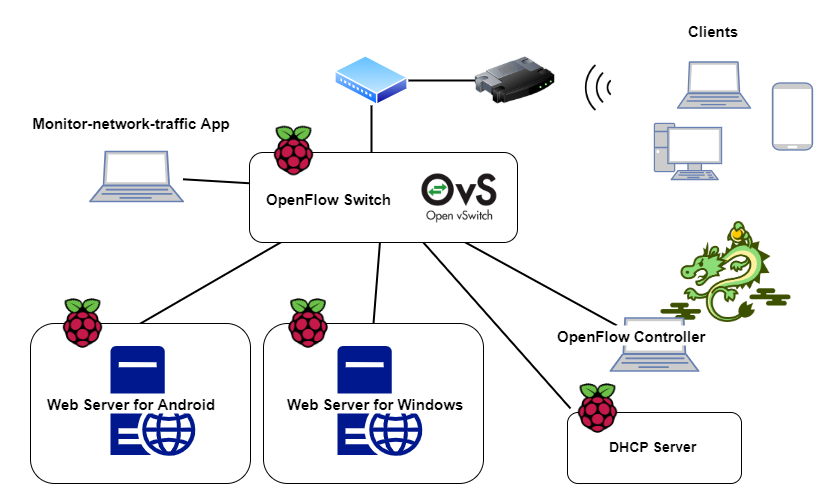
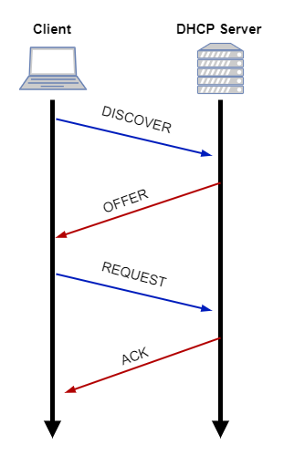
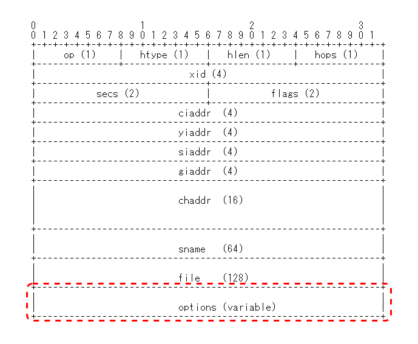

# Monitor-network-traffic

This application monitor traffic of the network of Windows, Android and iOS in real-time. I assume the network shown below and attach Monitor-network-traffic App to the switch. By using port-mirroring of Open vSwitch, I collect packets passing through the other ports and pass them to Monitor-network-traffic App.

This App use DHCP fingerprinting to detect OS of host computer when connected to the network. When a computer connects to the network, computer use DCHP to get IP address to communicate with other computers. DHCP DISCOVER, REQUEST message send from client include OS information of host computer. Therefore, by extracting that information we can detect OS of the computer connected to the network!

The following image shows the format of the DHCP message. OS information is included in options(variable) surrounded by red dotted line.

